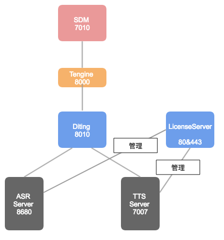
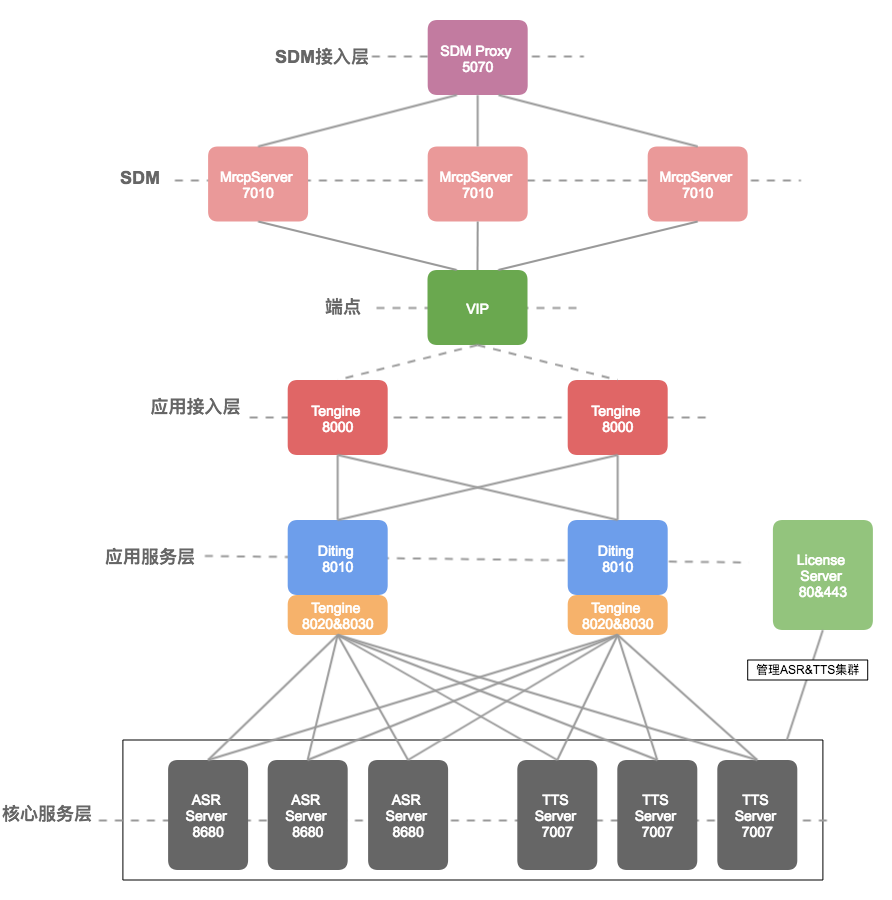

# 阿里云智能语音交互服务部署手册

阿里云智能语音交互

2018.3

# 目录 [目录]

[1. 前提准备 [4](#前提准备)](#前提准备)

[2. 名词解释 [4](#名词解释)](#名词解释)

[3. 硬件配置要求(最小资源)
[5](#硬件配置要求最小资源)](#硬件配置要求最小资源)

[4. 系统整体架构 [7](#系统整体架构)](#系统整体架构)

[4.1 最小环境下系统结构 [7](#最小环境下系统结构)](#最小环境下系统结构)

[4.2 正式环境下系统结构 [8](#正式环境下系统结构)](#正式环境下系统结构)

[5. 配置Java环境 [9](#配置java环境)](#配置java环境)

[6. LicenseServer [9](#licenseserver)](#licenseserver)

[7. Tengine [9](#tengine)](#tengine)

[7.1 二进制安装 [9](#二进制安装)](#二进制安装)

[7.2 编译安装 [9](#编译安装)](#编译安装)

[7.3 接入层nginx配置说明
[10](#接入层nginx配置说明)](#接入层nginx配置说明)

[7.4 应用层nginx配置说明(可选，单台ASR或TTS时不需要)
[11](#应用层nginx配置说明可选单台asr或tts时不需要)](#应用层nginx配置说明可选单台asr或tts时不需要)

[8. Diting [12](#diting)](#diting)

[8.1 解压缩 [12](#解压缩)](#解压缩)

[8.2 修改配置 [12](#修改配置)](#修改配置)

[8.3 启动 [13](#启动)](#启动)

[9. ASR [13](#asr)](#asr)

[9.1 选择版本 [13](#选择版本)](#选择版本)

[9.2 解压缩 [13](#解压缩-1)](#解压缩-1)

[9.3 拷贝配置和模型 [14](#拷贝配置和模型)](#拷贝配置和模型)

[9.4 建立动态链接库 [14](#建立动态链接库)](#建立动态链接库)

[9.5 修改配置 [14](#修改配置-1)](#修改配置-1)

[9.6 启动 [14](#启动-1)](#启动-1)

[10. 测试ASR和TTS [15](#测试asr和tts)](#测试asr和tts)

[11. TTS [15](#tts)](#tts)

[11.1 解压缩 [15](#解压缩-2)](#解压缩-2)

[11.2 修改配置 [15](#修改配置-2)](#修改配置-2)

[11.3 启动 [15](#启动-2)](#启动-2)

[12. SDM(可选) [16](#sdm可选)](#sdm可选)

[12.1 解压缩 [16](#解压缩-3)](#解压缩-3)

[12.2 修改配置 [16](#修改配置-3)](#修改配置-3)

[12.3 启动 [16](#启动-3)](#启动-3)

[13. Kamailio负载(可选) [16](#kamailio负载可选)](#kamailio负载可选)

[13.1 解压缩 [17](#解压缩-4)](#解压缩-4)

[13.2 修改配置 [17](#修改配置-4)](#修改配置-4)

[13.3 启动 [17](#启动-4)](#启动-4)

[14. 自学习平台(SLP) (可选)
[17](#自学习平台slp-可选)](#自学习平台slp-可选)

[14.1 Redis [17](#redis)](#redis)

[14.2 Mongodb [18](#mongodb)](#mongodb)

[14.3 ai-container [18](#ai-container)](#ai-container)

[14.4 customization-service
[20](#customization-service)](#customization-service)

[14.5 customlm-downloader
[21](#customlm-downloader)](#customlm-downloader)

[15. KeepAlived(可选) [22](#keepalived可选)](#keepalived可选)

[16. 转写服务(可选) [25](#转写服务可选)](#转写服务可选)

[17. FAQ [25](#faq)](#faq)

## 前提准备

-   熟悉Linux操作；

-   熟悉tengine(即Nginx)及其负载均衡机制；

-   所有程序或服务都在/home/admin目录下（可以使用admin账户或root账户）；

-   所有服务建议均以admin用户启动(注意1024以下端口只能以root用户或具有sudo权限的admin用户启动):

> \# 先用root账户增加admin用户
>
> sudo useradd admin
>
> sudo groupadd admin
>
> sudo passwd admin
>
> \# 建议为admin增加sudo权限：vim /etc/sudoers文件，增加以下内容
>
> admin   ALL=(ALL)   ALL

-   假设所有安装包下载在\`{src_install_dir}\`目录。

-   操作系统建议centos
    7.2及以上，且最好不要安装最小版操作系统（会导致一些基础依赖库缺失，比如openssl、pcre)。

## 名词解释

-   ASR

    -   应用名：speech-alisr。

    -   用途：语音识别引擎，将语音转为文字。

    -   部署要求：C++应用；着重关注各种基础依赖库导致的启动失败；运行内存至少96G(测试环境);

-   TTS

    -   应用名：nls-tts。

    -   用途：语音合成引擎，将文字转为语音。

    -   部署要求：Java应用；提前装好Java 1.8；运行内存至少96G(测试环境);

-   Diting

    -   应用名：diting。

    -   用途：与外部服务/负载均衡组件相链接，接收ASR识别请求和TTS请求，Diting可以理解为ASR&TTS引擎与外界相连的中间件。

    -   部署要求：Java应用；提前装好Java 1.8；至少4核8G；

-   Tengine

    -   应用名：tengine-2.1.2。

    -   用途：反向代理、负载均衡模块，类比nginx。

    -   部署要求：C应用；提前装好openssl、pcre；至少4核8G；

-   SDM

    -   应用名：alimrcp-server。

    -   用途：MRCP协议的实现，对外用以和各类呼叫平台(比如华为、avaya、genesys)进行对接，对内集成了ASR、TTS、NLU能力。

    -   部署要求：C++应用；至少4核8G；

-   Kamailio

    -   应用名：kamailio。

    -   用途：SDM的负载代理，解决SDM单点问题。

-   KeepAlived

    -   应用名：开源keepalived。

    -   用途：负责接入层的高可用。

-   nls-trans

    -   应用名：nls-trans。

    -   用途：文件转写服务。

-   自学习平台

    -   应用名：ai-container、customization-service、customlm-downloader。

    -   用途：专有云自学习平台，用以提升ASR语音识别效果。

    -   部署要求：Java应用；提前装好Java 1.8；至少16核64G；

## 硬件配置要求(最小资源) 

<table style="width:100%;">
<colgroup>
<col style="width: 9%" />
<col style="width: 8%" />
<col style="width: 16%" />
<col style="width: 16%" />
<col style="width: 10%" />
<col style="width: 10%" />
<col style="width: 10%" />
<col style="width: 9%" />
<col style="width: 9%" />
</colgroup>
<thead>
<tr>
<th style="text-align: center;">项目</th>
<th style="text-align: center;">功能</th>
<th style="text-align: center;">应用</th>
<th style="text-align: center;">CPU</th>
<th style="text-align: center;">核数</th>
<th style="text-align: center;">内存</th>
<th style="text-align: center;">硬盘</th>
<th style="text-align: center;">台数</th>
<th style="text-align: center;">备注</th>
</tr>
</thead>
<tbody>
<tr>
<th rowspan="4" style="text-align: center;">1</th>
<td rowspan="4" style="text-align: center;">
语

音

核

心

能

力
</td>
<td style="text-align: center;">ASR</td>
<td style="text-align: center;">v5-2682v4</td>
<td style="text-align: center;">32物理核</td>
<td style="text-align: center;">128G</td>
<td style="text-align: center;">1T</td>
<td style="text-align: center;">1</td>
<td style="text-align: center;">必选</td>
</tr>
<tr>
<td style="text-align: center;">TTS</td>
<td style="text-align: center;">v5-2683v4</td>
<td style="text-align: center;">28物理核</td>
<td style="text-align: center;">128G</td>
<td style="text-align: center;">600G</td>
<td style="text-align: center;">1</td>
<td style="text-align: center;">必选</td>
</tr>
<tr>
<td style="text-align: center;">Diting</td>
<td style="text-align: center;">虚拟机</td>
<td style="text-align: center;">4C</td>
<td style="text-align: center;">8G</td>
<td style="text-align: center;">500G</td>
<td style="text-align: center;">1</td>
<td style="text-align: center;">必选</td>
</tr>
<tr>
<td style="text-align: center;">Nginx</td>
<td style="text-align: center;">虚拟机</td>
<td style="text-align: center;">4C</td>
<td style="text-align: center;">8G</td>
<td style="text-align: center;">500G</td>
<td style="text-align: center;">1</td>
<td style="text-align: center;">必选</td>
</tr>
<tr>
<th rowspan="2" style="text-align: center;">2</th>
<td rowspan="2" style="text-align: center;">
M

R

C

P

协

议

层
</td>
<td style="text-align: center;">SDM</td>
<td style="text-align: center;">虚拟机</td>
<td style="text-align: center;">8C</td>
<td style="text-align: center;">16G</td>
<td style="text-align: center;">600G</td>
<td style="text-align: center;">1</td>
<td style="text-align: center;">在客户有呼叫平台情况下必选</td>
</tr>
<tr>
<td style="text-align: center;">Kamailio</td>
<td style="text-align: center;">虚拟机</td>
<td style="text-align: center;">8C</td>
<td style="text-align: center;">16G</td>
<td style="text-align: center;">600G</td>
<td style="text-align: center;">1</td>
<td style="text-align: center;">同上</td>
</tr>
<tr>
<th rowspan="3" style="text-align: center;">3</th>
<td rowspan="3" style="text-align: center;">
A

S

R

自

学

习

平

台
</td>
<td style="text-align: center;">AI-Containner</td>
<td style="text-align: center;">虚拟机</td>
<td style="text-align: center;">16C</td>
<td style="text-align: center;">64G</td>
<td style="text-align: center;">1T</td>
<td style="text-align: center;">1</td>
<td style="text-align: center;">在有自学习定制需求场景下必选</td>
</tr>
<tr>
<td style="text-align: center;">customization-service(SLP)</td>
<td style="text-align: center;">虚拟机</td>
<td style="text-align: center;">4C</td>
<td style="text-align: center;">8G</td>
<td style="text-align: center;">500G</td>
<td style="text-align: center;">1</td>
<td style="text-align: center;">同上</td>
</tr>
<tr>
<td style="text-align: center;">MongoDB&amp;Redis</td>
<td style="text-align: center;">v5-2683v4</td>
<td style="text-align: center;">16C</td>
<td style="text-align: center;">64G</td>
<td style="text-align: center;">1T</td>
<td style="text-align: center;">1</td>
<td style="text-align: center;">同上</td>
</tr>
</tbody>
</table>

## 系统整体架构

### 最小环境下系统结构

说明：

1.  该部署架构属于简化版部署，属于在poc阶段或测试环境下的架构；

2.  ASR、TTS服务本身各自需要一台高配服务器；

3.  SDM、Tengine、Diting、LicenseServer可以共用一台机器（至少8C16G）；

### 正式环境下系统结构

说明：

1.  该部署架构基于属于正式环境下的高可用部署；

2.  ASR、TTS服务本身各自需要多台高配服务器进行负载；

3.  所有服务不建议共用服务器，各服务所需的机器配置已在上一章节提供；

4.  应用层Tengine如果是多台，可以通过keepalived的vip进行访问；

5.  LicenseServer至少需要一台，建议多台（机器挂掉之后所有ASR、TTS都无法提供服务），部署台数为2N+1；

6.  SDM接入层负载比较轻，如果需要部署两台进行高可用，仍可以通过部署keepalived，对外提供vip访问；

## 配置Java环境

解压缩：

\# cd {src_install_dir}/Java/

\# tar zxvf jdk-8u101-linux-x64.tar.gz

sudo mv jdk1.8.0_101 /usr/local/

配置环境变量\`sudo vim /etc/profile\`，增加以下内容：

\# export JAVA_HOME=/usr/local/jdk1.8.0_101

\# export PATH=\${JAVA_HOME}/bin:\$PATH

执行命令使配置生效：

\# source /etc/profile \# 使配置生效

\# java -version \# 验证java版本

## LicenseServer

即apes服务，具体安装及使用可以查看LicenseServer目录下的安装文档。

注意：在启动其他语音服务前，需提前安装此服务、申请授权码之后才可以。

## Tengine

Tengine即Nginx，主要用来做服务间的负载均衡。

注意：

1.  如果需要进行TTS服务的负载，需要在编译Tengine时加入第三方模块。

2.  部署前操作系统可能需要额外安装一些依赖服务，比如：yum -y install
    pcre-devel openssl openssl-devel。

Tengine的部署提供两种方式：源码编译或者使用我们已经编译好的二进制程序。

### 二进制安装

直接使用我们已经编译好的二进制程序：

\# cp {src_install_dir}/Tengine/tengine-2.1.2-bin.tar.gz /home/admin/

\# cd /home/admin/

\# tar -xf tengine-2.1.2-bin.tar.gz

### 编译安装

\# cd {src_install_dir}/Tengine/

\# tar zxvf tengine-2.1.2-src.tar.gz

\# cp nginx_tcp_proxy_module_v0.4.5.zip tengine-2.1.2/ \#
tcp反向代理(做TTS引擎的负载时需要)

\# cd tengine-2.1.2

\# unzip nginx_tcp_proxy_module_v0.4.5.zip

\# patch -p1 \< ./nginx_tcp_proxy_module_v0.4.5/tcp.patch \# 打上补丁

\# 将安装程序生成在/home/admin/tengine-2.1.2目录

\# ./configure --prefix=/home/admin/tengine-2.1.2
--add-module={src_install_dir}/Nginx/nginx_tcp_proxy_module_v0.4.5

\# make && make install

### 接入层nginx配置说明

假设配置文件为/home/admin/tengine-2.1.2/nginx-diting.conf，端口号：8000；

http {

\# ...略...

upstream diting {

server diting1:8010;

server diting2:8010;

server diting3:8010;

check interval=3000 rise=2 fall=5 timeout=1000 type=http;

check_http_send "GET /checkpreload.htm HTTP/1.0\r\n\r\n";

check_http_expect_alive http_2xx http_3xx;

}

server {

listen 8000;

\# ...略...

location /realtime {

proxy_pass http://diting;

proxy_set_header Host \$host;

proxy_set_header X-Real-IP \$remote_addr;

proxy_set_header X-Forwarded-For \$proxy_add_x_forwarded_for;

proxy_http_version 1.1;

proxy_set_header Connection "upgrade";

proxy_set_header Upgrade \$http_upgrade;

}

location /tts {

proxy_pass http://diting_tts_cluster;

proxy_set_header Host \$host;

proxy_set_header X-Real-IP \$remote_addr;

proxy_set_header X-Forwarded-For \$proxy_add_x_forwarded_for;

proxy_http_version 1.1;

proxy_set_header Connection "upgrade";

proxy_set_header Upgrade \$http_upgrade;

}

}

\# ...略...

}

此外，安装包内单独附带了一个示例配置({src_install_dir}/Tengine/nginx-diting.conf)，可以基于该文件进行定制修改。

启动方式：

\# cd /home/admin/tengine-2.1.2/sbin/

\# ./nginx -c conf/nginx-diting.conf \#
启动，配置文件为/home/admin/tengine-2.1.2/conf/nginx-diting.conf

\# ps -ef \| grep nginx

\# ./nginx -c conf/nginx-diting.conf -s reload \#
重启，比如修改了配置文件

### 应用层nginx配置说明(可选，单台ASR或TTS时不需要)

假设配置文件为/home/admin/tengine-2.1.2/nginx-asr-tts.conf，端口号为8010和8020；

tcp { \# tts的反向代理

upstream tts_cluster {

server nls-tts-server1:7007 max_fails=3;

server nls-tts-server2:7007 max_fails=3;

}

server {

listen 8010;

proxy_pass tts_cluster;

}

}

http {

\# ...略...

upstream asr_cluster {

consistent_hash \$http_x_request_id;

server 192.168.192.133:8680;

server 192.168.192.134:8680;

check interval=3000 rise=2 fall=5 timeout=1000 type=http;

check_http_send "GET /check.htm HTTP/1.0\r\n\r\n";

check_http_expect_alive http_2xx http_3xx;

}

server {

listen 8020;

\# ...略...

location / { \# asr的反向代理

proxy_pass http://asr_cluster;

proxy_set_header Host \$host;

proxy_set_header X-Real-IP \$remote_addr;

proxy_set_header X-Forwarded-For \$proxy_add_x_forwarded_for;

proxy_http_version 1.1;

proxy_set_header Connection "";

}

\# ...略...

}

此外，安装包内单独附带了一个示例配置({src_install_dir}/Tengine/nginx-asr-tts.conf)，可以基于该文件进行定制修改。

启动方式：

\# cd /home/admin/tengine-2.1.2/sbin/

\# ./nginx -c conf/nginx-asr-tts.conf \#
启动，配置文件为/home/admin/tengine-2.1.2/conf/nginx-asr-tts.conf

\# ps -ef \| grep nginx

\# ./nginx -c conf/nginx-asr-tts.conf -s reload \#
重启，比如修改了配置文件

## Diting

diting是语音核心能力ASR、TTS的网关层，单台机器diting服务可以同时支持ASR、TTS的接入。

### 解压缩

\# mkdir -p /home/admin/diting \# 创建运行目录

\# tar –xf Diting/nls-diting-1.7.0.2.tar.gz -C /home/admin/diting/ \#
解压

### 修改配置

Diting的配置文件(diting/conf/application.properties)中几个关键地方说明如下：

\#
diting本身的监听端口，如果端口冲突，可以改为其他，同时注意修改接入层Tengine配置中diting的端口；

server.port=8010

server.address=0.0.0.0 \# diting本身的监听ip

management.port=7002 \# diting本身的管理端口

\# asr服务的ip及端口

asr.url=http://127.0.0.1:8680

\# tts服务的ip及端口

tts.grpc.target=127.0.0.1:7007

\# !!! 注意
!!!：如果diting后不是直接挂asr、tts，比如在asr、tts之前有一层asr、tts的反向代理Tengine，

\# 则这两处的ip和port要修改为Tengine的ip：port。

### 启动

\# cd /home/admin/diting/bin

\# ./start.sh

\#
查看启动是否成功，如果不成功需查看/home/admin/diting/log/下日志进行分析

\# ps -ef \| grep diting \| grep -v grep

## ASR

### 选择版本

asr我们一般会提供两个版本，命名分别如下所示：

\# asr应用名-版本号-7u的os-cpu指令集-需授权服务

speech-alisr-1.3.21-0-7u-avx2-server-license.tgz

speech-alisr-1.3.21-0-7u-sse-server-license.tgz \#
同上，差别在于avx2和sse

以上两个版本的差异在于avx2和sse的差异，分别对应到支持avx2指令和sse指令的cpu，建议部署前先确定部署ASR的机器cpu支持哪种指令，建议使用支持avx2指令的cpu。可以通过以下命令查看：

\# cat /proc/cpuinfo \| grep avx2 \# 如果有输出表示支持avx2

\# cat /proc/cpuinfo \| grep sse \# 如果有输出表示支持sse

### 解压缩

解压speech-alisr到/home/admin目录

\# cd {src_install_dir}/ASR/

\# tar -xf speech-alisr-xxxxxx.tgz

### 拷贝配置和模型

\# cp -rf {src_install_dir}/ASR/conf /home/admin/speech-alisr/

\# cp -rf {src_install_dir}/ASR/models /home/admin/speech-alisr/

### 建立动态链接库

\# cd /home/admin/speech-alisr/

\# export LD_LIBRARY_PATH=./lib64/:\$LD_LIBRARY_PAT

\# ldd bin/alisr-server \# 查看缺少哪些依赖库，对于缺少的可能需要yum安装

如果报错缺少以下这些依赖：

libldap-2.3.so.0 =\> not found

libssl.so.6 =\> not found

libcurl.so.3 =\> not found

libcrypto.so.6 =\> not found

可以通过软链解决：

\# cd /usr/lib64

\#
将前面的so版本软链为libldap-2.3.so.0，注意libldap-2.4.so.2.10.3版本号在不同os下可能不同，注意修改

\# ln -s libldap-2.4.so.2.10.3 libldap-2.3.so.0

\# 同上

\# ln -s libssl.so.1.0.1e libssl.so.6

\# ln -s libcurl.so.4.3.0 libcurl.so.3

\# ln -s libcrypto.so.1.0.1e libcrypto.so.6

如果报错提示缺少gfortan.so 之类错误，则可以yum： sudo yum install
libgfortran解决。

### 修改配置

配置文件speech-alisr/conf/server.json中需要修改以下设置：

"licence_file_path":"ip1，ip2，ip3", \#
这里设置的ip地址即是LicenseServer(apes)的地址，注意顺序一致

### 启动

\# cd /home/admin/speech-alisr/

\# export LD_LIBRARY_PATH=../lib64/

\#前台模式启动asr，以便查看启动是否成功，如果成功删掉，改为下面的脚本启动

\# ./bin/alisr-server -c conf/server.json

\# ./bin/alisr-ctrl.sh start \# 后台模式启动

\# ps -ef \| grep alisr \| grep -v grep \# 查看进程是否正常运行

## 测试ASR和TTS

在安装包目录下有相应的测试工具，可以用来测试ASR、TTS链路的连通性。

## TTS

### 解压缩

\# cd {src_install_dir}/TTS

\# tar –xf nls-tts_XXXXXX.tar.gz

\# mv nls-tts /home/admin/

### 修改配置

配置文件nls-tts/conf/application.properties中需要修改以下设置：

engine.apesAddress = ip1，ip2，ip3
\#这里设置的ip地址即是LicenseServer(apes)的地址，注意顺序

文件描述符修改，由于TTS采用短连接，当并发或QPS过高时，会消耗大量文件描述符，所以需要增加打开文件描述符的数量：

\# 查看当前文件描述符限制：

\# ulimit -n

\# 一次性修改：

\# ulimit -SHn 102400

\# 永久修改：

\# vim /etc/security/limits.conf

\# 最后增加如下配置：

hard nofile 102400

soft nofile 102400

jvm修改，修改bin/jvm.options ,建议为系统内存一半并小于32g:

-Xms16g

-Xmx16g

### 启动

\# cd /home/admin/nls-tts/

\#
第一次启动可以手动前台启动，查看是否启动成功，如果成功则杀掉改为后台模式启动

\# ./bin/service.sh

\# 后台启动

\# ./bin/appctl start

\# 查看进程是否正常运行

\# ./bin/appctl status

\# ps -ef \| grep nls-tts \| grep -v grep

## SDM(可选)

### 解压缩

\# cd {src_install_dir}

\# tar -xf alimrcp-server.tar.gz

\# mv alimrcp-server /home/admin/

### 修改配置

1.  其中/home/admin/alimrcp-server/conf/unimrcpserver.xml为主配置文件，暂时不用修改。

2.  修改/home/admin/alimrcp-server/conf/service-tts.conf:

Url:ws://nginx-ip:port/tts \# TTS地址，仅仅修改ip和端口

1.  修改/home/admin/alimrcp-server/conf/service-asr.conf:

Url:ws://nginx-ip:port/realtime \# TTS地址，仅仅修改ip和端口

### 启动

\# cd /home/admin/alimrcp-server/bin/

\# ./service.sh \# 前台启动验证是否成功，成功之后Ctrl + C杀掉

\# ./appctl start \# 后台启动

\# ps -ef \| grep unimrcp \| grep -v grep \# 查看进程是否正常运行

SDM的监听端口在7010。

## Kamailio负载(可选)

SDM的负载均衡模块。当只有一台SDM时，不需要部署。

### 解压缩

\# cd {src_install_dir}/SDM/

\# tar -xf kamailio-5.0.4_bin.tar.gz

\# mv kamailio /home/admin/

### 修改配置

修改/home/admin/kamailio/etc/kamailio/dispatcher.list:

\#Load Balance

1 sip:sdm-server1:7010 \# 设置为SDM的ip和port

1 sip:sdm-server2:7010

### 启动

\# cd /home/admin/kamailio/sbin/

\# ./kamailio -f /home/admin/kamailio/etc/kamailio/kamailio.cfg

kamailio默认监听在5070端口上。

## 自学习平台(SLP) (可选)

**自学习平台依赖Redis和MongoDB服务，这里对这两个服务的安装做一个简单介绍，如果当前环境中已经有了redis和mongodb服务，则可以共用而无需重新部署。**

### Redis

\# cd {src_install_dir}/SLP

\# unzip redis-3.2.8-bin.zip

\# mv redis-3.2.8 /home/admin/

\# cd /home/admin/redis-3.2.8

\# ./redis-server redis.conf \# 启动

### Mongodb

\# cd {src_install_dir}/SLP

\# tar –xf mongodb-linux-x86_64-3.6.0.tgz

\# mv mongodb-linux-x86_64-3.6.0 /home/admin/

\# cd /home/admin/mongodb-linux-x86_64-3.6.0

\# mkdir logs dbdata

\# cd bin

\# ./mongod –bind_ip {填上本机ip} –port 27017 --dbpath /home/admin/
mongodb-linux-x86_64-3.6.0/dbdata --fork --logpath /home/admin/
mongodb-linux-x86_64-3.6.0/logs/mongodb.log \# 启动

### ai-container

#### 解压缩

\# cd {src_install_dir}/SLP

\# tar -xf ai-container-XXXXX.tar.gz

\# mv ai-container /home/admin/

#### 修改配置

编辑文件/home/admin/ai-container/application.properties。

必须提供以下配置：

\# 回调地址，\${host}和\${port}需要设置为customizaiton-service的地址

local.callback.url=http://\${host}:\${port}/asr/models/{customization_id}/train-callback

\# 安全令牌，需要与customization-service的配置保持已知

token.api=cy2y6z6hoirrq2os

\# Redis服务地址

jedis.host=10.182.158.44

\# MongoDB服务地址

spring.data.mongodb.host=10.182.145.117

以下配置项可以使用默认配置：

\# 远端数据路径

module.remote.path=/home/admin/ai-container/remote

\# 本地数据路径

app.root.path=/home/admin/ai-container/

\# Redis服务端口

jedis.port=6379

\# MongoDB服务端口

spring.data.mongodb.port=27017

\# MongoDB数据库

spring.data.mongodb.database=speech-files

\# MongoDB文件数据库

spring.data.mongodb.grid-fs-database=speech-files

\# MongoDB数据库

mongo.collection.name=fs

#### 启动

启动ai-container：

cd /home/admin/ai-container

./start.sh

另外，在第一次启动ai-container之后，需要执行以下命令(仅在第一次)：

\# cd /home/admin/ai-container

\# ./install.sh

#### 算法部署

ai-container的运行依赖算法模块asrp.tar.gz及配套文件的的部署。下面以一个例子来描述算法模块的部署：

1.  假定ai-container安装在/home/admin/ai-container/下面

2.  将算法模块文件:asrp.tar.gz、start.sh、lm_init.groovy这三个文件存放在/home/admin/ai-container/remote/1/下面，稍微解释下这个路径的意义，remote其实就是远端的意思，因为算法模块要被保存在mongo上，1表示的是版本号，建议用数字，尽量用小写（remote这个路径在application.properties中的module.remote.path中配置）；

3.  首先需要启动ai-container服务（因为部署接口是REST的，ai-container自带的）；

4.  然后调用算法更新的接口，本例调用方式为：

\# curl -X POST
"http://localhost:7001/local/mongo?path=/home/admin/ai-container/remote/1&version=1&token=cy2y6z6hoirrq2os"

> 解释一下上面的三个参数，path是算法文件的目录，version就是给这个版本起的版本号，建议与上面目录的名字一致token是api的鉴权token；

1.  部署模型需要的数据，数据有三个文件，放在/home/admin/ai-container/data下面，调用：

\# curl -X POST
"http://localhost:7001/local/mongo/data?localRoot=/home/admin/ai-container/data&mongoRoot=/asrp/data&token=cy2y6z6hoirrq2os"

> 其中需要注意的参数就是localRoot，这一定要是数据文件的绝对路径；

### customization-service

customization-service不会占用太多系统资源，可以同别的服务部署在同样的机器上。

**注意：该服务和ASR、TTS服务一样，需要进行授权才能正式使用。**

#### 解压缩

\# cd {src_install_dir}/SLP

\# tar -xf customization-service-XXXXX.tar.gz

\# mv customization-service /home/admin/

#### 修改配置

编辑/home/admin/customization-service/application.properties文件

必须提供以下配置：

\# 定制模型训练服务地址（配置ai-container的服务ip和port）

nls.customization.service.model.train.service.address=http://\${ip}:\${port}

\# 模型训练服务令牌（需要与ai-container的配置保持已知）

nls.customization.service.model.train.service.token=cy2y6z6hoirrq2os

\# 授权服务地址列表

nls.customization.service.apes-client.address-list=127.0.0.1

\# MongoDB服务地址

spring.data.mongodb.host=\${ip}

\# Redis服务器地址

spring.redis.host=\${ip}

以下配置可以使用默认配置：

\# 日志配置

logging.path=logs

logging.pattern.file=%d{HH:mm:ss.SSS} %5p \[%15.15t\]
\[%40.40logger{40}\] \[%32.32X{REQUEST_ID}\] %m%n

\# 定制模型训练配置模板路径

nls.customization.service.model.train.config.template-file=data/model/train-config-template.json

\# 定制词表数据路径

nls.customization.service.vocab.base-dir=data/vocab

\# 定制词表权重设置

nls.customization.service.vocab.weight-map=5:90;4:80;3:70;2:60;1:30;-1:-30;-2:-60;-3:-70;-4:-80;-5:-90;-6:-200

\# 自学习平台服务地址

server.address=0.0.0.0

\# 自学习平台服务端口

server.port=8100

\# MongoDB服务端口

spring.data.mongodb.port=27017

\# Redis数据库

spring.redis.database=0

\# Redis服务器连接端口

spring.redis.port=6379

\# Redis服务器连接密码（默认为空）

spring.redis.password=

\# 连接池最大连接数（使用负值表示没有限制）

spring.redis.pool.max-active=8

\# 连接池最大阻塞等待时间（使用负值表示没有限制）

spring.redis.pool.max-wait=-1

\# 连接池中的最大空闲连接

spring.redis.pool.max-idle=8

\# 连接池中的最小空闲连接

spring.redis.pool.min-idle=0

\# 连接超时时间（毫秒）

spring.redis.timeout=200

#### 启动

\# cd /home/admin/customization-service/

\# ./service.sh start

#### 查询资源状态

服务启动成功会提供查询资源状态的页面，可以通过浏览器（或curl命令）查看服务状态：

\# curl http://\${host}:8100/ \#
\${host}是部署了customization-service的服务器的IP

### customlm-downloader

使用自学习平台的定制模型功能时，需要在部署了alisr-server的机器上部署customlm-downloader。customlm-downloader用于将定制模型同步到每台alisr-server服务器上。

#### 解压缩

\# cd {src_install_dir}/SLP

\# tar -xf customlm-downloader-XXXXX.tar.gz

\# mv customlm-downloader /home/admin/

#### 修改配置

编辑配置文件/home/admin/customlm-downloader/application.properties。

必须提供以下配置：

\# MongoDB数据库地址

spring.data.mongodb.host=\${mongodb_host}

\#
模型下载位置(如果customlm-downloader和speech-alisr安装在同一台机器则无需修改，否则需要将下面路径改为实际路标，比如当前目录下)

nls.customization.downloader.local-root=/home/admin/speech-alisr/models/customlms

以下配置项可以使用默认配置

\# 日志配置

logging.path=/home/admin/customlm-downloader/logs

logging.pattern.file=%d{HH:mm:ss.SSS} %5p \[%15.15t\]
\[%40.40logger{40}\] \[%32.32X{REQUEST_ID}\] %m%n

\# 服务控制台地址

server.address=0.0.0.0

\# 服务控制台端口

server.port=8080

\# MongoDB数据库端口

spring.data.mongodb.port=27017

#### 启动

\# cd /home/admin/customlm-downloader

\# ./service.sh

## KeepAlived(可选)

#### 安装

有两种方式安装：yum(sudo yum -y install keepalived)或者源码编译。

**\# cd {src_install_dir}/KeepAlived**

**\# tar -xf keepalived-1.2.23.tar.gz && cd keepalived-1.2.23**

**\# ./configure --prefix=/home/admin/keepalived-1.2.23**

**\# make && make install**

**\# sudo mkdir /etc/keepalived**

**\# sudo cp /home/admin/keepalived-1.2.23/etc/rc.d/init.d/keepalived
/etc/rc.d/init.d/**

**\# sudo cp /home/admin/keepalived-1.2.23/etc/sysconfig/keepalived
/etc/sysconfig/**

**\# sudo cp /home/admin/keepalived-1.2.23/sbin/keepalived /usr/sbin/**

**\# sudo cp
/home/admin/keepalived-1.2.23/etc/keepalived/keepalived.conf
/etc/keepalived/**

#### 配置

在master机器上增加配置文件/etc/keepalived/keepalived.conf：

**\# cat /etc/keepalived/keepalived.conf**

global_defs {

notification_email {

**\# acassen@firewall.loc \#
指定keepalived在发生切换时需要发送email到的对象**

}

**\#notification_email_from Alexandre.Cassen@firewall.loc \#
指定发件人**

**\#smtp_server 192.168.200.1 \# smtp 服务器地址**

**\#smtp_connect_timeout 30 \# smtp 服务器连接超时时间**

router_id LVS_DEVEL \# 运行keepalived机器的一个标识

}

vrrp_instance VI_1 {

state MASTER \# 状态，master机器上设置为MASTER，slave机器上设置为BACKUP

interface eth0 \# 本机网卡地址，按实际情况修改

virtual_router_id 51

priority 100 \# 优先级，注意slave机器上改值要小于master机器

advert_int 1

authentication {

auth_type PASS

auth_pass 1111

}

virtual_ipaddress {

192.168.14.200 \# vip地址，注意按实际情况修改

}

}

在slave机器上增加配置文件/etc/keepalived/keepalived.conf：

**\# cat /etc/keepalived/keepalived.conf**

global_defs {

notification_email {

**\# acassen@firewall.loc \#
指定keepalived在发生切换时需要发送email到的对象**

}

**\#notification_email_from Alexandre.Cassen@firewall.loc \#
指定发件人**

**\#smtp_server 192.168.200.1 \# smtp 服务器地址**

**\#smtp_connect_timeout 30 \# smtp 服务器连接超时时间**

router_id LVS_DEVEL \# 运行keepalived机器的一个标识

}

vrrp_instance VI_1 {

state MASTER \# 状态，master机器上设置为MASTER，slave机器上设置为BACKUP

interface eth0 \# 本机网卡地址，按实际情况修改

virtual_router_id 51

priority 40 \# 优先级，注意slave机器上改值要小于master机器

advert_int 1

authentication {

auth_type PASS

auth_pass 1111

}

virtual_ipaddress {

192.168.14.200 \# vip地址，注意按实际情况修改

}

}

**注意上面配置中state、interface、priority、virtual_ipaddress字段的值要根据实际情况进行修改。**

#### 启动

\# sudo service keepalived start

#### 服务可用性检测

以上部署只是简单搭建了机器的可用性检测，如果需要对当前机器上服务进行检测，也可以通过keepalived进行判断，keepalived常用的健康检查方式健康检查方式一共有HTTP_GET、SSL_GET、TCP_CHECK、SMTP_CHECK和MISC_CHECK等，当然也可以自己写脚本进行判断。这里假设待检测的进程是XXX。则需要在/etc/keepalived/keepalived.conf文件中做一下修改：

**\###　新增　###**

vrrp_script chk_XXX {

script "/etc/keepalived/check_XXX.sh" \# 服务检测并试图重启

interval 2 \# 每2s检查一次

weight -5 \# 检测失败（脚本返回非0）则优先级减少5个值

fall 3 \# 如果连续失败次数达到此值，则认为服务器已down

rise 2 \# 如果连续成功次数达到此值，则认为服务器已up，但不修改优先级

}

vrrp_instance VI_1 {

\# ... 略 ...

\###　新增　###

track_script { \# 引用VRRP脚本，即在 vrrp_script
部分指定的名字。定期运行它们来改变优先级，并最终引发主备切换。

chk_XXX

}

}

自己根据实际业务编写如下脚本：

**\# cat /etc/keepalived/check_XXX.sh**

**\#!/bin/bash**

counter=\$(ps -C XXX --no-heading\|wc -l)

if \[ "\${counter}" = "0" \]; then

/home/admin/XXX/bin/appctl start

./appctl start

sleep 2

counter=\$(ps -C XXX --no-heading\|wc -l)

if \[ "\${counter}" = "0" \]; then

/etc/rc.d/init.d/keepalived stop

fi

fi

## 转写服务(可选)

## FAQ
